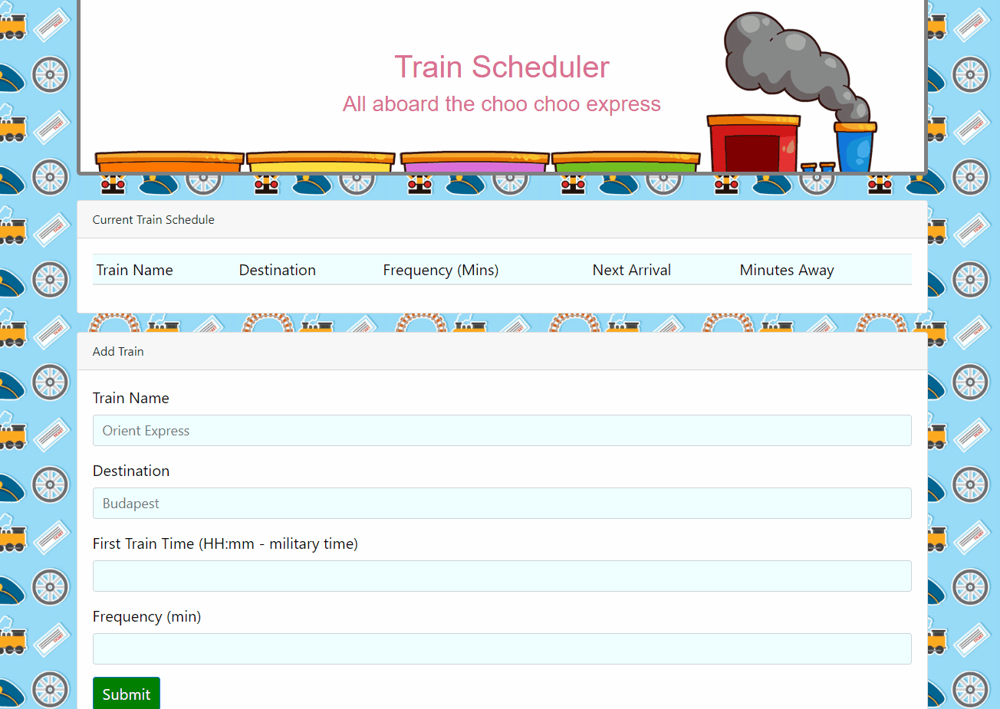

# Firebase-Train-Scheduler

In this assignment, i've created a train schedule application that incorporates Google's Firebase to host arrival and departure data. My app will retrieve and manipulate this information with Moment.js. This website will provide up-to-date information about various trains, namely their arrival times and how many minutes remain until they arrive at their station.

### Built With:
- HTML5
- CSS3
- JavaScript
- Bootstrap Framework
- jQuery
- Firebase Database
- Moment.js

### Demonstration

